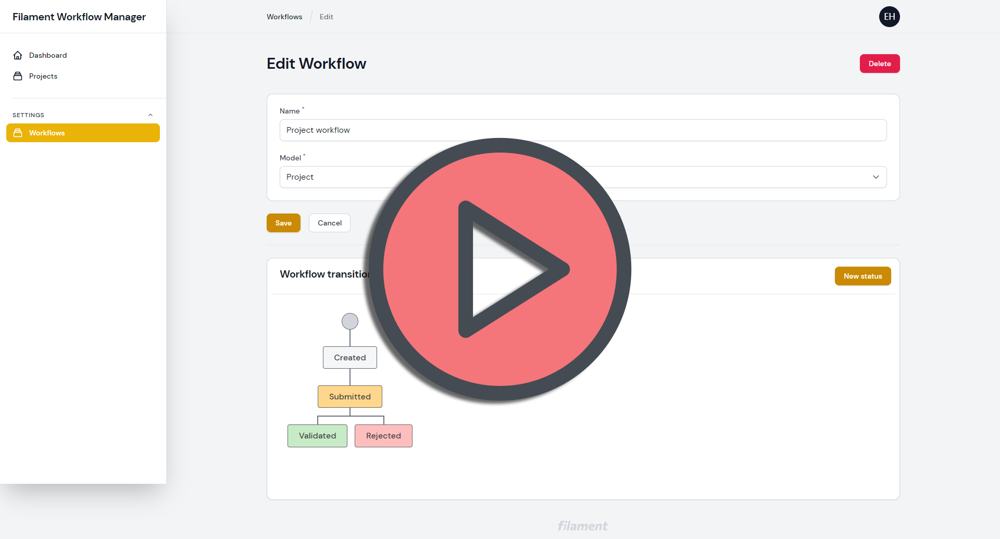

## Installation

1. Create a Laravel project
```bash
laravel new MyProject
```

2. Install the package
```bash
composer require heloufir/filament-workflow-manager
```

3. Register the package into your application providers `config/app.php`
```bash
\Heloufir\FilamentWorkflowManager\FilamentWorkflowManagerServiceProvider::class,
```

4. Run migrations
```bash
php artisan migrate
```

5. Create a new Filament user (refer to the Filament documentation)
[https://filamentphp.com/docs/2.x/admin/installation#installation](https://filamentphp.com/docs/2.x/admin/installation#installation)

6. Serve your project
```bash
php artisan serve
```
Here you can see a menu named `Workflows` under `Settings` menu group, it's where you can manage your workflows.

## Configuration

1. Create your model
```bash
php artisan make:model MyModel
```

2. Configure your model to implement Workflow manager
```php
use Heloufir\FilamentWorkflowManager\Core\HasWorkflow;
use Heloufir\FilamentWorkflowManager\Core\InteractsWithWorkflows;
// ...

class Project extends Model implements HasWorkflow
{
    use InteractsWithWorkflows;
    
    // ...
}
```

Here you need to add the implementation of the interface `InteractsWithWorkflows` and add the use of the trait `InteractsWithWorkflows` to your model.

3. Create a workflow


After you have configured your model, you can now create a workflow linked to this model, watch the following demo video:
[](https://user-images.githubusercontent.com/6197875/177192142-6ea200cb-9d2b-4bb3-a2b2-d65e25a4da66.mp4)

4. Add a Filament resource to manage your model
Refere to the Filament documentation: [https://filamentphp.com/docs/2.x/admin/resources/getting-started#creating-a-resource](https://filamentphp.com/docs/2.x/admin/resources/getting-started#creating-a-resource)

5. Configure the Filament resource
- In your `form` Filament resource declaration you need to add `WorkflowStatusInput::make()` so your users can change the status of `YourModel` depending on your workflow configuration:

```php
use Heloufir\FilamentWorkflowManager\Forms\Components\WorkflowStatusInput;

public static function form(Form $form): Form
{
    return $form
        ->schema([
            // ...

            WorkflowStatusInput::make()
        ]);
}
```

If you wan't to show the model current status in the Filament resource table, you need to add the `WorkflowStatusColumn::make()` column definition:

```php
use Heloufir\FilamentWorkflowManager\Tables\Columns\WorkflowStatusColumn;

public static function table(Table $table): Table
{
    return $table
        ->columns([
            // ...

            WorkflowStatusColumn::make()
        ]);
}
```

The last configuration needed, is to add `WorkflowResource` trait to the `EditRecord` and `CreateRecord` components of your model

**EditRecord component**
```php
// ...
use Heloufir\FilamentWorkflowManager\Core\WorkflowResource;

class EditMyModel extends EditRecord
{
    use WorkflowResource;

    // ...
}
```

**CreateRecord component**
```php
// ...
use Heloufir\FilamentWorkflowManager\Core\WorkflowResource;

class EditMyModel extends CreateRecord
{
    use WorkflowResource;

    // ...
}
```
