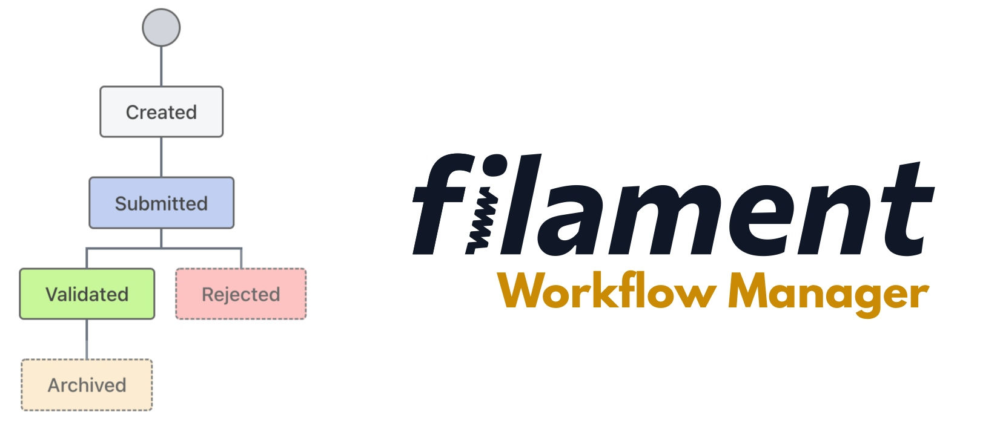

# Filament Workflow Manager

[](https://packagist.org/packages/heloufir/filament-workflow-manager)
[](https://packagist.org/packages/heloufir/filament-workflow-manager)

This package provides a Filament resource where you can configure and manage your workflows, and also provides some functions, helpers, traits, ... to help you attach statuses to your configured models.




## Installation

You can install the package via composer:

```bash
composer require heloufir/filament-workflow-manager
```

The package comes with publishable assets:

**Migrations**
```bash
php artisan vendor:publish --tag="filament-workflow-manager-migrations"
```

**Config file**
```bash
php artisan vendor:publish --tag="filament-workflow-manager-config"
```

## Quick start
Please read the following steps to understand how to use this package.
[Quick start steps](QUICKSTART.md)

## Changelog

Please see [CHANGELOG](CHANGELOG.md) for more information on what has changed recently.

## Contributing

Please see [CONTRIBUTING](.github/CONTRIBUTING.md) for details.

## Security Vulnerabilities

Please review [our security policy](https://github.com/heloufir/filament-workflow-manager/security/policy) on how to report security vulnerabilities.

## Support

For fast support, please join the [**Filament** community](https://filamentphp.com/discord) discord and send me a message in this channel [#workflow-manager](https://discord.com/channels/883083792112300104/993621948833726535)

## Credits

- [heloufir](https://github.com/heloufir)
- [All Contributors](https://github.com/heloufir/filament-workflow-manager/graphs/contributors)

## License

The MIT License (MIT). Please see [License File](LICENSE.md) for more information.
